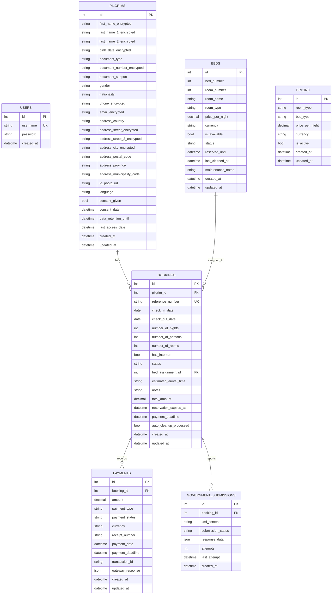
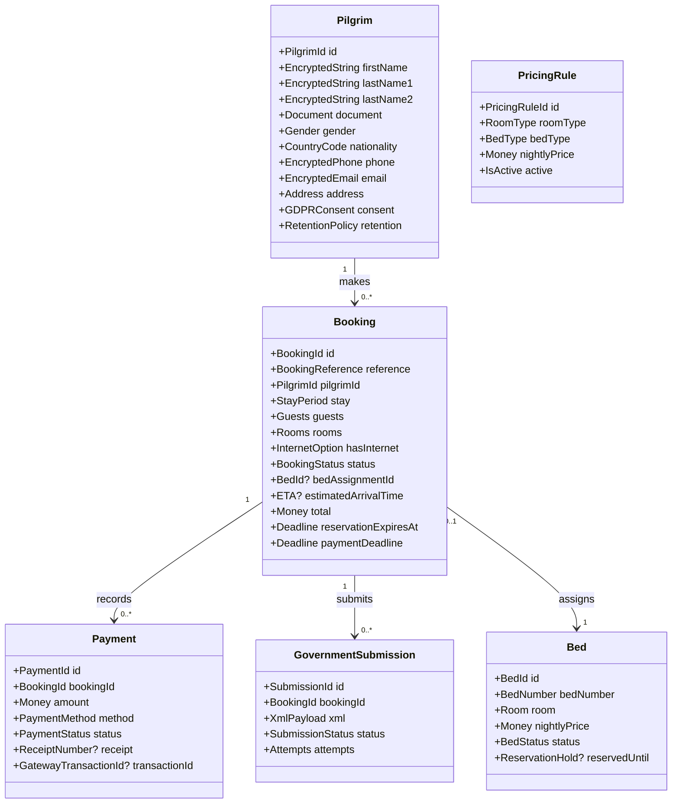
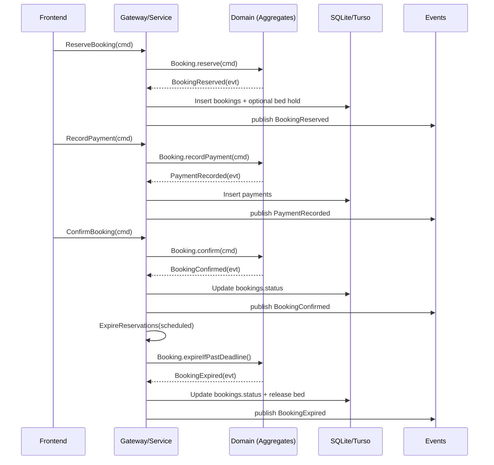
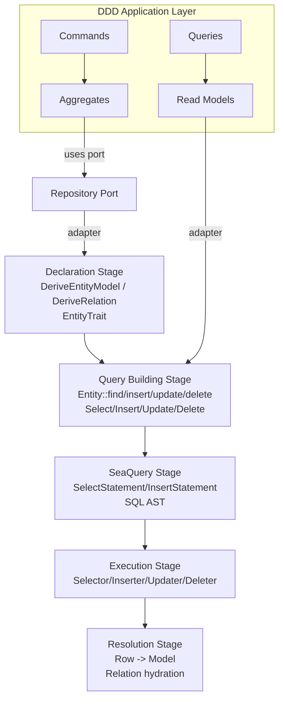

# domain_model: DDD + SeaORM + Seaography (Turso/SQLite)

This document defines the **domain model** (DDD), how it maps to the current schema in [schema.ts](file:///wsl.localhost/Ubuntu/home/glam/git/personal/AlbergueMunicipalCarrascalejo/domain_model/schema.ts), and how we will represent persistence with **SeaORM** (Entity/Model/ActiveModel) and expose read models via **Seaography**.

**Database**: Turso (SQLite-compatible). Development uses a local SQLite file and keeps SQL portable to Turso.

## Single Source Of Truth

- The current source of truth is [schema.ts](file:///wsl.localhost/Ubuntu/home/glam/git/personal/AlbergueMunicipalCarrascalejo/domain_model/schema.ts).
- We will extend it where the domain needs stronger invariants (constraints, relationships, extra entities), but we will not contradict it.

## Domain Overview

### Bounded Contexts

- **Identity & Compliance**: pilgrims, identity document handling metadata, GDPR retention fields.
- **Booking**: reservation lifecycle, deadlines/timeouts, bed assignment, booking reference.
- **Payments**: payment lifecycle and reconciliation.
- **Inventory**: bed availability/status, cleaning/maintenance.
- **Pricing**: room/bed type pricing.
- **Government Reporting**: MIR/SOAP submission tracking.

### Aggregates (DDD)

- **Pilgrim** (Aggregate Root)
  - Purpose: identity, contact, GDPR consent/retention.
  - Persistence: `pilgrims` table.

- **Booking** (Aggregate Root)
  - Purpose: reservation lifecycle with deadlines, optional bed assignment, payment window.
  - Entities inside aggregate (modeled as separate tables but domain-owned):
    - `Payment` (1..N) → `payments`
    - `GovernmentSubmission` (0..N) → `government_submissions`
  - Persistence: `bookings` plus child tables.

- **Bed** (Aggregate Root)
  - Purpose: availability and operational status (available/reserved/occupied/maintenance/cleaning).
  - Persistence: `beds`.

- **PricingRule** (Aggregate Root)
  - Purpose: pricing configuration by `(roomType, bedType)`.
  - Persistence: `pricing`.

- **User** (Aggregate Root)
  - Purpose: authentication identity.
  - Persistence: `users`.

## Mermaid Diagrams

### 1) ER Diagram (Current Schema.ts)

### 2) Aggregate Model (DDD)

### 3) Booking Flow (Commands → Events)

### 4) SeaORM Layered Abstraction (How We Use It)

SeaORM is a layered abstraction: declaration → query building → execution → resolution.

## Domain Invariants (Derived From Schema + Tests)

- A Booking has a **reservation deadline** and **payment deadline**.
- A Booking has a **date range** (`check_in_date`, `check_out_date`) and derived `number_of_nights`.
- Bed assignment is optional at reservation time; once assigned, it must reference an existing bed.
- Bed status is one of: available, reserved, occupied, maintenance, cleaning.
- Payments belong to a booking and can be multiple per booking.

## Commands & Queries

### Commands

- `RegisterPilgrim`
- `UpdatePilgrimContact`
- `ReserveBooking`
- `AssignBedToBooking`
- `RecordPayment`
- `ConfirmBooking`
- `CancelBooking`
- `ExpireBookingReservations` (scheduled)
- `SubmitGovernmentReport`
- `MarkBedStatus`
- `SetPricingRule`

### Queries

- `GetBookingByReference`
- `GetBookingsByPilgrim`
- `GetBedsByStatus`
- `GetAvailableBedsForDateRange`
- `GetPricing(roomType, bedType)`
- `GetDashboardStats` (occupancy/availability)

## Domain Events

- `PilgrimRegistered`
- `PilgrimUpdated`
- `GDPRConsentRecorded`
- `BookingReserved`
- `BookingBedAssigned`
- `BookingConfirmed`
- `BookingCancelled`
- `BookingExpired`
- `PaymentRecorded`
- `PaymentCompleted`
- `GovernmentSubmissionQueued`
- `GovernmentSubmissionSucceeded`
- `GovernmentSubmissionFailed`
- `BedStatusChanged`

## SeaORM Mapping (How Tables Become Entities)

For each table in `schema.ts`, SeaORM represents it as:

- `Model`: an immutable row type (what you query)
- `ActiveModel`: a mutable builder for inserts/updates
- `Entity`: the entry point for queries (`Entity::find()`, `Entity::insert()`, etc.)
- `Relation`: relation metadata (`belongs_to`, `has_many`) for eager/lazy loading

### Example Mapping (Bookings)

- `bookings` table → `bookings::Entity`
- `bookings::Model` corresponds to a stored booking snapshot
- `bookings::ActiveModel` is used by the persistence adapter to create/update rows
- `Relation` defines:
  - belongs_to `pilgrims`
  - belongs_to `beds` (optional)
  - has_many `payments`
  - has_many `government_submissions`

## Seaography (GraphQL)

Seaography can expose a GraphQL schema directly from SeaORM entities (including filters, pagination, and nested relations). Entities are generated with `--seaography`, then a GraphQL server can be scaffolded by `seaography-cli`.

## Next Repo Changes (After Approval)

1. Replace `domain_model/README.md` with this document.
2. Extend `schema.ts` with any missing domain-required entities/relations (e.g. notifications/audit log) and align with E2E expectations.
3. Add `domain_model/rust/` Cargo workspace:
   - domain crate (aggregates/value objects/events)
   - persistence crate (SeaORM entities)
   - migration crate (SeaORM migrations targeting SQLite)
   - seaography crate (GraphQL server scaffold)
4. Add runnable commands and minimal verification (cargo build/test; migration apply).
