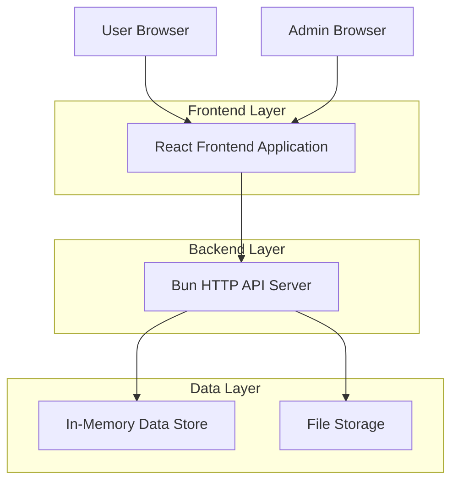
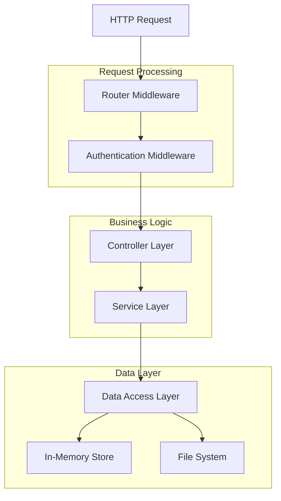
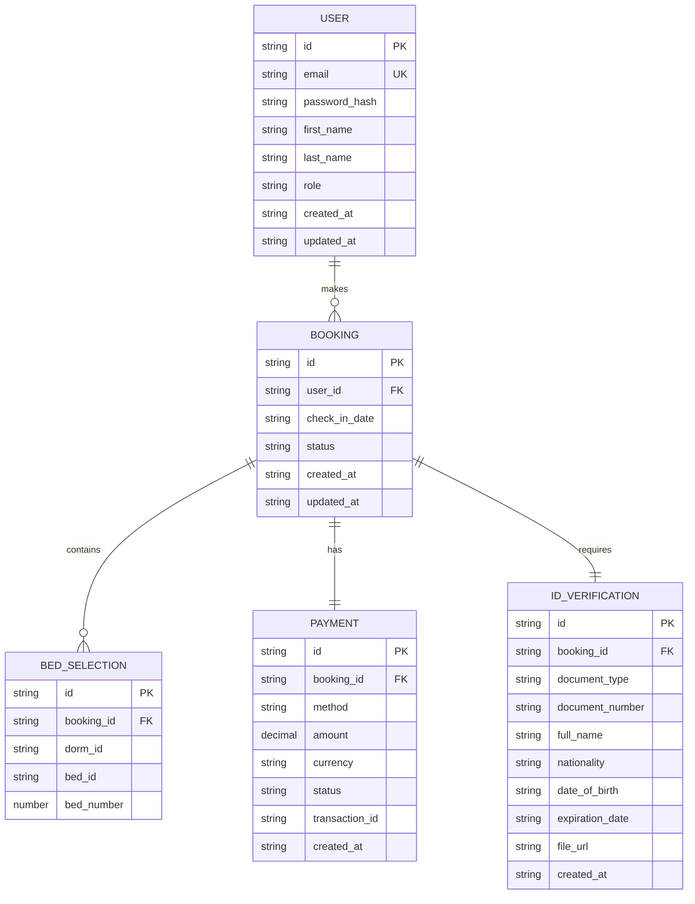

## 1. Architecture Design



## 2. Technology Description

**Core Stack:**

- **Runtime/Package Manager**: Bun (latest stable version)

- **Frontend Framework**: React 19.2.3+ with TypeScript

- **Build Tool**: Vite 7+ configured for Bun compatibility

- **Routing**: TanStack Router (latest) with type-safe routing and nested routes

- **UI Components**: shadcn/ui with Tailwind CSS integration

- **Styling**: Tailwind CSS 4 + with custom theme for Extremadura color palette

- **State Management**: React Context + TanStack Query for server state

- **Animations**: Framer Motion for page transitions and micro-interactions

- **Internationalization**: intlayer + react-i18next for EN/ES support

- **Linting**: ESLint 9+ with TypeScript configuration

**Initialization Tool**: vite-init (Bun-compatible)

**Backend Architecture:**

- **Server**: Bun HTTP APIs with native TypeScript support

- **Storage**: In-memory data structures with file-based persistence for demo

- **File Upload**: Multer-compatible middleware for ID document uploads

- **OCR**: Client-side OCR helper library (Tesseract.js or similar)

- **Authentication**: JWT-based with HTTP-only cookies

## 3. Route Definitions

### Frontend Routes (TanStack Router)

| Route                   | Purpose                                                   | Layout        |
| ----------------------- | --------------------------------------------------------- | ------------- |
| `/`                     | Homepage with hero section and quick availability checker | Public        |
| `/availability`         | Date selection and bed availability grid                  | Public        |
| `/booking`              | Multi-step booking flow with nested routes                | Public        |
| `/booking/guest-info`   | Guest information form step                               | Public        |
| `/booking/payment`      | Payment method selection step                             | Public        |
| `/booking/verification` | ID document upload and OCR verification                   | Public        |
| `/booking/confirmation` | Booking confirmation and summary                          | Public        |
| `/account`              | User dashboard with booking management                    | Authenticated |
| `/account/bookings`     | List of user bookings                                     | Authenticated |
| `/account/settings`     | User profile and preferences                              | Authenticated |
| `/info/restaurants`     | Recommended restaurants guide                             | Public        |
| `/info/sightseeing`     | Local attractions and tours                               | Public        |
| `/info/camino`          | Camino de Santiago information                            | Public        |
| `/info/emergency`       | Emergency contacts and medical info                       | Public        |
| `/login`                | User authentication                                       | Public        |
| `/register`             | User registration                                         | Public        |
| `/admin`                | Admin dashboard overview                                  | Admin         |
| `/admin/bookings`       | Reservation management with filters                       | Admin         |
| `/admin/bookings/:id`   | Detailed booking view and editing                         | Admin         |
| `/admin/payments`       | Payment tracking and management                           | Admin         |
| `/admin/reports`        | Analytics and reporting dashboard                         | Admin         |
| `/admin/settings`       | System configuration and user management                  | Admin         |

### API Routes (Bun Server)

| Route                          | Method | Purpose                                |
| ------------------------------ | ------ | -------------------------------------- |
| `/api/availability`            | GET    | Get bed availability for specific date |
| `/api/bookings`                | POST   | Create new booking                     |
| `/api/bookings/:id`            | GET    | Get specific booking details           |
| `/api/bookings`                | GET    | List bookings with filters (admin)     |
| `/api/bookings/:id`            | PUT    | Update booking details                 |
| `/api/bookings/:id/cancel`     | PUT    | Cancel booking                         |
| `/api/bookings/:id/reschedule` | PUT    | Reschedule booking to new date         |
| `/api/payments`                | GET    | List payments with filters             |
| `/api/payments/:id`            | PUT    | Update payment status                  |
| `/api/auth/signup`             | POST   | User registration                      |
| `/api/auth/login`              | POST   | User authentication                    |
| `/api/auth/logout`             | POST   | User logout                            |
| `/api/account/bookings`        | GET    | Get user's bookings                    |
| `/api/admin/reports`           | GET    | Get analytics data                     |
| `/api/upload/id`               | POST   | Upload ID document                     |
| `/api/ocr/extract`             | POST   | Extract data from ID document          |

## 4. API Definitions

### 4.1 Core API Types

```typescript
// Booking Types
interface Booking {
  id: string;
  userId: string;
  checkInDate: string; // YYYY-MM-DD
  beds: BedSelection[];
  guestInfo: GuestInfo;
  paymentInfo: PaymentInfo;
  idVerification: IDVerification;
  status: "pending" | "confirmed" | "cancelled";
  createdAt: string;
  updatedAt: string;
}

interface BedSelection {
  dormId: "D1" | "D2";
  bedId: string; // D1-B1, D1-B2, etc.
  bedNumber: number;
}

interface GuestInfo {
  firstName: string;
  lastName: string;
  email: string;
  phone: string;
  country: string;
  caminoCredential?: string;
}

interface PaymentInfo {
  method: "card" | "bizum" | "cash" | "apple_pay" | "paypal";
  amount: number;
  currency: "EUR";
  status: "pending" | "paid" | "refunded";
  transactionId?: string;
}

interface IDVerification {
  documentType: "id_card" | "passport";
  documentNumber: string;
  fullName: string;
  nationality: string;
  dateOfBirth: string;
  expirationDate: string;
  fileUrl: string;
}

// Availability Types
interface AvailabilityResponse {
  date: string;
  dorms: {
    D1: BedStatus[];
    D2: BedStatus[];
  };
}

interface BedStatus {
  bedId: string;
  bedNumber: number;
  status: "available" | "reserved" | "occupied";
  bookingId?: string;
}

// User Types
interface User {
  id: string;
  email: string;
  firstName: string;
  lastName: string;
  role: "user" | "admin";
  createdAt: string;
}

interface AuthResponse {
  user: User;
  token: string;
}

// Admin Report Types
interface OccupancyReport {
  dateRange: {
    start: string;
    end: string;
  };
  overallOccupancy: number;
  dailyBreakdown: {
    date: string;
    occupancy: number;
    dorms: {
      D1: number;
      D2: number;
    };
  }[];
}

interface RevenueReport {
  dateRange: {
    start: string;
    end: string;
  };
  totalRevenue: number;
  revenueByMethod: {
    card: number;
    bizum: number;
    cash: number;
    apple_pay: number;
    paypal: number;
  };
  dailyRevenue: {
    date: string;
    amount: number;
  }[];
}
```

### 4.2 Authentication API

**POST /api/auth/login**

Request:

```json
{
  "email": "pilgrim@example.com",
  "password": "securePassword123"
}
```

Response:

```json
{
  "user": {
    "id": "uuid",
    "email": "pilgrim@example.com",
    "firstName": "John",
    "lastName": "Doe",
    "role": "user"
  },
  "token": "jwt_token_here"
}
```

**POST /api/bookings**

Request:

```json
{
  "checkInDate": "2024-12-15",
  "beds": [
    {
      "dormId": "D1",
      "bedId": "D1-B3",
      "bedNumber": 3
    }
  ],
  "guestInfo": {
    "firstName": "John",
    "lastName": "Doe",
    "email": "pilgrim@example.com",
    "phone": "+34123456789",
    "country": "United States",
    "caminoCredential": "12345"
  },
  "paymentInfo": {
    "method": "card",
    "amount": 15.0,
    "currency": "EUR"
  }
}
```

## 5. Server Architecture Diagram



## 6. Data Model

### 6.1 Entity Relationship Diagram



### 6.2 Data Definition Language

```sql
-- Users Table
CREATE TABLE users (
    id TEXT PRIMARY KEY,
    email TEXT UNIQUE NOT NULL,
    password_hash TEXT NOT NULL,
    first_name TEXT NOT NULL,
    last_name TEXT NOT NULL,
    role TEXT NOT NULL DEFAULT 'user' CHECK (role IN ('user', 'admin')),
    created_at TEXT NOT NULL DEFAULT CURRENT_TIMESTAMP,
    updated_at TEXT NOT NULL DEFAULT CURRENT_TIMESTAMP
);

-- Bookings Table
CREATE TABLE bookings (
    id TEXT PRIMARY KEY,
    user_id TEXT NOT NULL,
    check_in_date TEXT NOT NULL,
    status TEXT NOT NULL CHECK (status IN ('pending', 'confirmed', 'cancelled')),
    created_at TEXT NOT NULL DEFAULT CURRENT_TIMESTAMP,
    updated_at TEXT NOT NULL DEFAULT CURRENT_TIMESTAMP,
    FOREIGN KEY (user_id) REFERENCES users(id)
);

-- Bed Selections Table
CREATE TABLE bed_selections (
    id TEXT PRIMARY KEY,
    booking_id TEXT NOT NULL,
    dorm_id TEXT NOT NULL CHECK (dorm_id IN ('D1', 'D2')),
    bed_id TEXT NOT NULL,
    bed_number INTEGER NOT NULL,
    created_at TEXT NOT NULL DEFAULT CURRENT_TIMESTAMP,
    FOREIGN KEY (booking_id) REFERENCES bookings(id)
);

-- Payments Table
CREATE TABLE payments (
    id TEXT PRIMARY KEY,
    booking_id TEXT NOT NULL,
    method TEXT NOT NULL CHECK (method IN ('card', 'bizum', 'cash', 'apple_pay', 'paypal')),
    amount DECIMAL(10,2) NOT NULL,
    currency TEXT NOT NULL DEFAULT 'EUR',
    status TEXT NOT NULL CHECK (status IN ('pending', 'paid', 'refunded')),
    transaction_id TEXT,
    created_at TEXT NOT NULL DEFAULT CURRENT_TIMESTAMP,
    FOREIGN KEY (booking_id) REFERENCES bookings(id)
);

-- ID Verifications Table
CREATE TABLE id_verifications (
    id TEXT PRIMARY KEY,
    booking_id TEXT NOT NULL,
    document_type TEXT NOT NULL CHECK (document_type IN ('id_card', 'passport')),
    document_number TEXT NOT NULL,
    full_name TEXT NOT NULL,
    nationality TEXT NOT NULL,
    date_of_birth TEXT NOT NULL,
    expiration_date TEXT NOT NULL,
    file_url TEXT NOT NULL,
    created_at TEXT NOT NULL DEFAULT CURRENT_TIMESTAMP,
    FOREIGN KEY (booking_id) REFERENCES bookings(id)
);

-- Indexes for performance
CREATE INDEX idx_users_email ON users(email);
CREATE INDEX idx_bookings_user_id ON bookings(user_id);
CREATE INDEX idx_bookings_check_in_date ON bookings(check_in_date);
CREATE INDEX idx_bookings_status ON bookings(status);
CREATE INDEX idx_bed_selections_booking_id ON bed_selections(booking_id);
CREATE INDEX idx_bed_selections_dorm_bed ON bed_selections(dorm_id, bed_id);
CREATE INDEX idx_payments_booking_id ON payments(booking_id);
CREATE INDEX idx_payments_status ON payments(status);
CREATE INDEX idx_id_verifications_booking_id ON id_verifications(booking_id);
```

## 7. Project Structure

```
src/
├── components/           # Reusable UI components
│   ├── ui/              # shadcn/ui components
│   ├── layout/          # Layout components (Header, Footer, AdminLayout)
│   ├── booking/         # Booking-specific components
│   ├── admin/           # Admin-specific components
│   └── shared/          # Shared components
├── routes/              # TanStack Router route definitions
│   ├── __root.tsx       # Root route
│   ├── index.tsx        # Homepage
│   ├── booking.tsx      # Booking routes
│   ├── account.tsx      # Account routes
│   ├── admin.tsx        # Admin routes
│   └── info.tsx         # Information pages
├── features/            # Feature-based modules
│   ├── auth/            # Authentication logic
│   ├── booking/         # Booking state and logic
│   ├── availability/    # Availability management
│   ├── payments/        # Payment processing
│   ├── admin/           # Admin functionality
│   └── i18n/            # Internationalization
├── lib/                 # Utility libraries
│   ├── api/             # API client and types
│   ├── auth/            # Auth utilities
│   ├── ocr/             # OCR helper functions
│   ├── utils/           # General utilities
│   └── constants/       # App constants
├── assets/              # Static assets
└── styles/              # Global styles and Tailwind config

server/                  # Bun HTTP API server
├── routes/              # API route handlers
├── middleware/          # Custom middleware
├── services/            # Business logic
├── utils/               # Server utilities
└── data/                # Data storage and models
```

## 8. Animation & Reactive Patterns

### 8.1 Lio.js Usage Guidelines

- **Scope**: Limited to Astro islands for reactive data streams and async operations

- **Boundaries**: No global state management - use only for component-level observables

- **Integration**: Compatible with TanStack Query for server state synchronization

- **Performance**: Lightweight alternative to heavy reactive libraries, < 2KB gzipped

### 8.2 Anime.js Implementation

- **Micro-animations**: Hover effects, button interactions, form field transitions

- **Performance**: GPU-accelerated transforms, will-change optimization

- **Accessibility**: Respect prefers-reduced-motion, provide reduced motion alternatives

- **Boundaries**: Used exclusively within Astro islands, no page-level animations

### 8.3 Usage Constraints

- **Astro Islands Only**: Both libraries restricted to interactive island components

- **No Global Effects**: Avoid site-wide animation systems or global reactive states

- **UnoCSS Compatible**: All animations must work with UnoCSS utility classes

- **Bundle Size**: Monitor impact on island chunk sizes, lazy-load when necessary

## 9. Configuration Files

**tailwind.config.js** (Extremadura Color Theme):

```javascript
module.exports = {
  theme: {
    extend: {
      colors: {
        primary: {
          DEFAULT: "#00AB39",
          light: "#33C266",
          dark: "#00882C",
        },
        secondary: {
          DEFAULT: "#0071BC",
          light: "#338DC9",
          dark: "#005A96",
        },
        accent: {
          DEFAULT: "#EAC102",
          light: "#EED435",
          dark: "#BB9A02",
        },
        status: {
          red: "#ED1C24",
          available: "#E6F7EB",
          reserved: "#FDF5E6",
          occupied: "#FFE6E6",
        },
      },
    },
  },
};
```

**uno.config.ts** (UnoCSS Configuration):

```typescript
import { defineConfig } from "unocss";
import { presetUno, presetAttributify, presetIcons } from "unocss";

export default defineConfig({
  presets: [presetUno(), presetAttributify(), presetIcons()],
  theme: {
    colors: {
      primary: {
        DEFAULT: "#00AB39",
        light: "#33C266",
        dark: "#00882C",
      },
      secondary: {
        DEFAULT: "#0071BC",
        light: "#338DC9",
        dark: "#005A96",
      },
      accent: {
        DEFAULT: "#EAC102",
        light: "#EED435",
        dark: "#BB9A02",
      },
    },
    animation: {
      keyframes: {
        "fade-in": {
          "0%": { opacity: "0" },
          "100%": { opacity: "1" },
        },
        "slide-up": {
          "0%": { transform: "translateY(10px)", opacity: "0" },
          "100%": { transform: "translateY(0)", opacity: "1" },
        },
      },
    },
  },
  shortcuts: [
    [
      "btn-primary",
      "bg-primary hover:bg-primary-dark text-white transition-colors duration-200",
    ],
    [
      "card-hover",
      "hover:shadow-lg hover:-translate-y-1 transition-all duration-300",
    ],
  ],
});
```

**vite.config.ts** (Bun + TanStack Router):

```typescript
import { defineConfig } from "vite";
import react from "@vitejs/plugin-react";
import { TanStackRouterVite } from "@tanstack/router-plugin/vite";

export default defineConfig({
  plugins: [TanStackRouterVite(), react()],
  server: {
    proxy: {
      "/api": {
        target: "http://localhost:3001",
        changeOrigin: true,
      },
    },
  },
});
```
