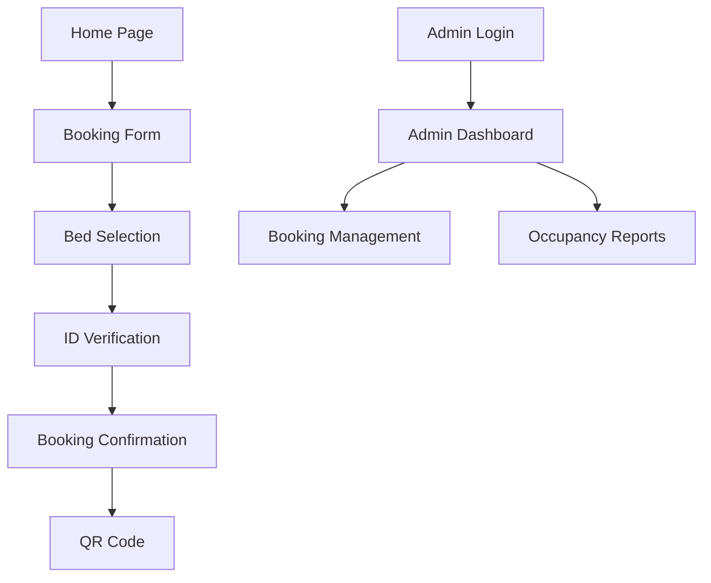

## 1. Product Overview
A neobrutalist web application redesign using UnoCSS with brutalist aesthetics while maintaining the Extremadura municipal albergue brand identity. The design emphasizes raw, bold visual elements with hand-drawn accents through Rough.js, creating an authentic and approachable municipal service experience.

## 2. Core Features

### 2.1 User Roles
| Role | Registration Method | Core Permissions |
|------|---------------------|------------------|
| Pilgrim | Online booking form | Book beds, upload ID, view reservations |
| Admin | Manual setup | Manage bookings, view reports, system settings |
| Municipal Staff | Staff credentials | Process check-ins, manage availability |

### 2.2 Feature Module
The albergue booking system consists of the following main pages:
1. **Home page**: Hero section, booking form, municipal information.
2. **Booking page**: Bed selection, date picker, pilgrim details.
3. **ID Verification page**: Document upload, OCR validation, selfie capture.
4. **Confirmation page**: Booking summary, QR code, contact details.
5. **Admin dashboard**: Booking management, occupancy reports, settings.

### 2.3 Page Details
| Page Name | Module Name | Feature description |
|-----------|-------------|---------------------|
| Home page | Hero section | Display brutalist welcome message with Rough.js borders, municipal branding. |
| Home page | Booking form | Neobrutalist input fields with thick borders, date selection with chunky calendar. |
| Booking page | Bed selection | Grid layout with brutalist card design, availability status with bold colors. |
| Booking page | Pilgrim form | Chunky input fields, neobrutalist labels, rough sketch borders. |
| ID Verification | Document upload | Drag-and-drop zone with hand-drawn borders, file validation. |
| ID Verification | OCR preview | Display extracted data in brutalist cards with rough edges. |
| Confirmation | Booking summary | Neobrutalist card layout with thick borders, QR code display. |
| Admin dashboard | Booking list | Table with brutalist styling, thick borders, bold status indicators. |
| Admin dashboard | Occupancy chart | Rough.js chart borders, chunky data visualization. |

## 3. Core Process
**Pilgrim Booking Flow:**
1. Visitor lands on home page with brutalist hero section
2. Selects dates and number of beds using chunky interface elements
3. Provides pilgrim details through neobrutalist form fields
4. Uploads ID documents with drag-and-drop rough border zones
5. Reviews OCR data in brutalist preview cards
6. Confirms booking with chunky button and receives QR code

**Admin Management Flow:**
1. Admin accesses dashboard through municipal portal
2. Views bookings in brutalist table layout with thick borders
3. Manages occupancy through chunky interface elements
4. Processes check-ins with rough sketch confirmation dialogs

## 4. User Interface Design

### 4.1 Design Style
- **Primary Colors**: Extremadura palette (Green `#00AB39`, White `#FFFFFF`, Black `#000000`)
- **Accent Colors**: Yellow `#EAC102`, Red `#ED1C24`, Blue `#0071BC`
- **Typography**: Bold, chunky sans-serif fonts with thick weights
- **Borders**: Thick (4-8px) solid borders with Rough.js hand-drawn effects
- **Spacing**: Generous padding and margins (16-32px) for brutalist aesthetic
- **Buttons**: Large, chunky buttons with thick borders and hover effects
- **Forms**: Input fields with thick borders, bold labels, rough sketch edges
- **Icons**: Geometric, minimalist icons with thick strokes

### 4.2 Page Design Overview
| Page Name | Module Name | UI Elements |
|-----------|-------------|-------------|
| Home page | Hero section | Brutalist headline with Rough.js border, chunky CTA button, municipal logo in thick frame. |
| Home page | Booking form | Thick-bordered input fields, chunky date picker, bold primary button with hover effect. |
| Booking page | Bed grid | Card-based layout with 4px borders, availability indicators with thick status badges. |
| ID Verification | Upload zone | Dashed rough border (8px thick), drag-and-drop hint with chunky typography. |
| Confirmation | Summary card | Thick bordered container (6px), QR code with rough frame, chunky text elements. |
| Admin dashboard | Data table | Thick table borders (3px), bold header row, chunky pagination controls. |

### 4.3 Responsiveness
- **Desktop-first** approach with mobile adaptation
- **Breakpoints**: Mobile (<768px), Tablet (768-1024px), Desktop (>1024px)
- **Mobile adaptations**: Stack brutalist cards vertically, maintain thick borders, adjust font sizes proportionally
- **Touch optimization**: Large tap targets (48px minimum) for chunky buttons and form elements

### 4.4 3D Scene Guidance
Not applicable for this neobrutalist 2D design project.