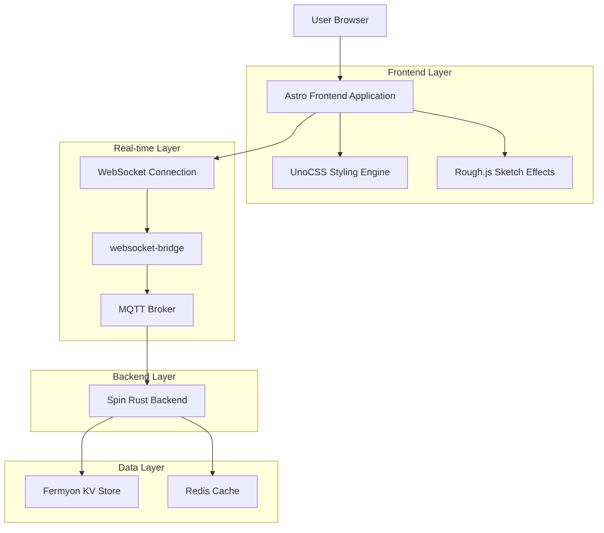
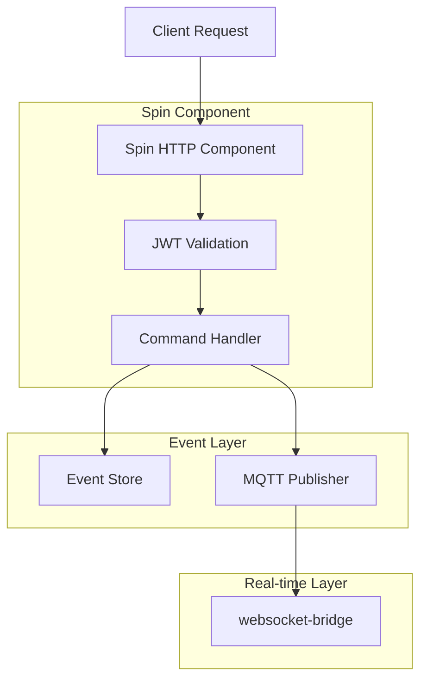
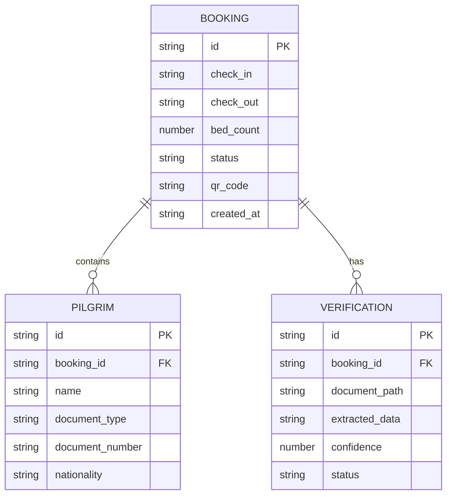

## 1. Architecture design



## 2. Technology Description

- **Frontend**: Astro@5 + UnoCSS@65 + TypeScript@5 + Solid.js (islands only)
- **Initialization Tool**: astro-create
- **Styling**: UnoCSS with neobrutalist preset, custom Extremadura color tokens
- **Sketch Effects**: Rough.js@4 for hand-drawn borders and accents
- **Backend**: Rust@1.83 + Spin@3 (Wasm components)
- **Real-time**: MQTT via Mosquitto + websocket-bridge
- **Deployment**: Vercel (frontend) + Fermyon Cloud (backend)

## 3. Route definitions

| Route             | Purpose                                        |
| ----------------- | ---------------------------------------------- |
| /                 | Home page with brutalist hero and booking form |
| /booking          | Bed selection and pilgrim details              |
| /verification     | ID document upload and OCR validation          |
| /confirmation     | Booking summary with QR code                   |
| /admin            | Dashboard for booking management               |
| /admin/bookings   | Detailed booking list and controls             |
| /api/bookings     | Booking API endpoints (Spin component)         |
| /api/verification | ID verification API (Spin component)           |

## 4. API definitions

### 4.1 Booking API

```
POST /api/bookings/create
```

Request:
| Param Name | Param Type | isRequired | Description |
|------------|------------|------------|-------------|
| check_in | string | true | ISO date string for arrival |
| check_out | string | true | ISO date string for departure |
| beds | number | true | Number of beds requested |
| pilgrims | array | true | Array of pilgrim details |

Response:
| Param Name | Param Type | Description |
|------------|------------|-------------|
| booking_id | string | Unique booking identifier |
| qr_code | string | QR code data URL |
| status | string | Booking status |

Example:

```json
{
  "check_in": "2025-12-25",
  "check_out": "2025-12-26",
  "beds": 2,
  "pilgrims": [
    {
      "name": "Juan García",
      "document_type": "DNI",
      "document_number": "12345678A"
    }
  ]
}
```

### 4.2 Verification API

```
POST /api/verification/upload
```

Request:
| Param Name | Param Type | isRequired | Description |
|------------|------------|------------|-------------|
| document_type | string | true | Type of document (DNI/Passport) |
| file | binary | true | Document image file |

Response:
| Param Name | Param Type | Description |
|------------|------------|-------------|
| extracted_data | object | OCR extracted information |
| confidence | number | OCR confidence score |

## 5. Server architecture diagram



## 6. Data model

### 6.1 Data model definition



### 6.2 UnoCSS Configuration

```javascript
// uno.config.ts
import { defineConfig } from "unocss";
import presetBrutal from "@unocss/preset-brutal";

export default defineConfig({
  presets: [
    presetBrutal({
      colors: {
        primary: "#00AB39",
        secondary: "#FFFFFF",
        accent: "#EAC102",
        danger: "#ED1C24",
        info: "#0071BC",
        dark: "#000000",
      },
      borderWidth: {
        brutal: "4px",
        chunky: "8px",
      },
      spacing: {
        brutal: "32px",
        chunky: "64px",
      },
    }),
  ],
  theme: {
    extend: {
      fontFamily: {
        brutal: ["Space Grotesk", "sans-serif"],
      },
    },
  },
});
```

### 6.3 Rough.js Integration

```typescript
// utils/rough.ts
import rough from "roughjs/bundled/rough.esm.js";

export const addBrutalBorder = (element: HTMLElement, options = {}) => {
  const rc = rough.svg(element);
  const border = rc.rectangle(0, 0, element.offsetWidth, element.offsetHeight, {
    roughness: 2.5,
    bowing: 4,
    stroke: "#000000",
    strokeWidth: 4,
    ...options,
  });
  element.appendChild(border);
};
```
