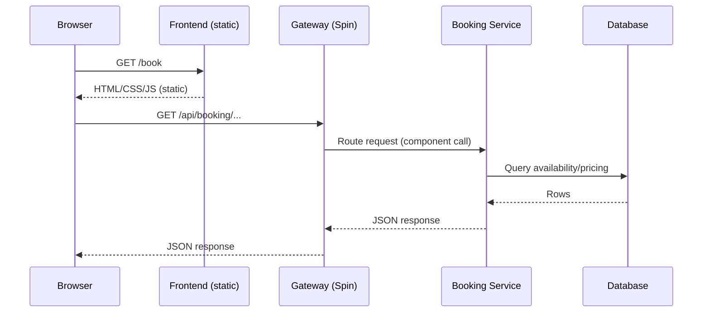
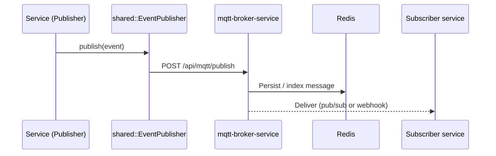

# 6. Runtime View

Representative runtime scenarios are shown below.

## 6.1 Fetch booking information

## 6.2 Publish domain event (evented architecture)

The project intends to use an internal broker component to publish and fan-out events (e.g., via MQTT topics) and optional webhook delivery.

See also:
- Existing proposal notes: [.trae Evented Architecture](../../.trae/documents/Evented%20Architecture%20with%20MQTT,%20CQRS,%20DLQ%20and%20Schemas.md)