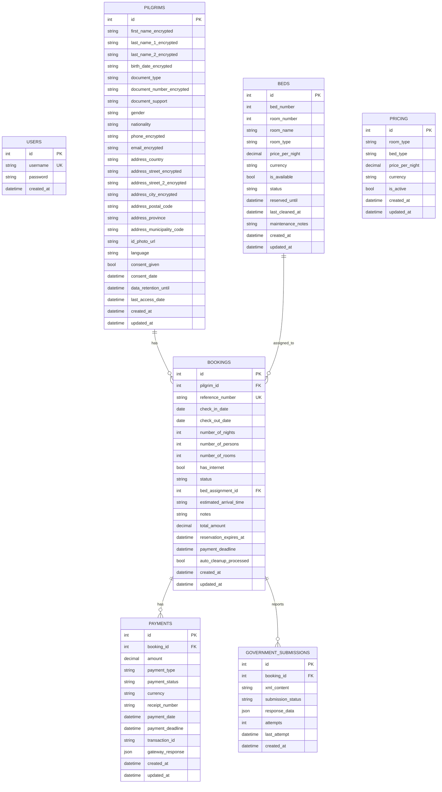
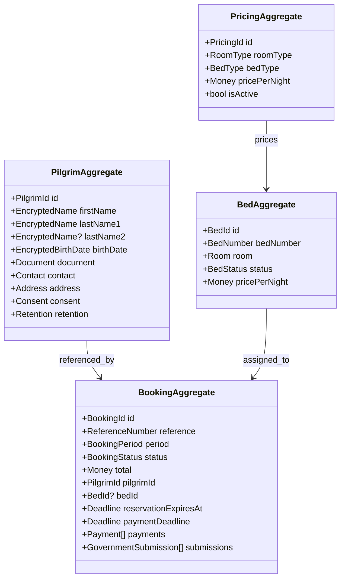
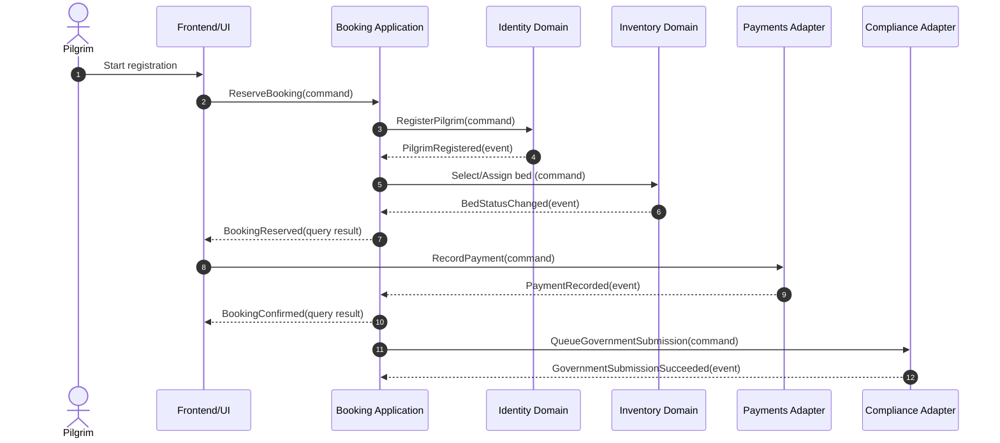
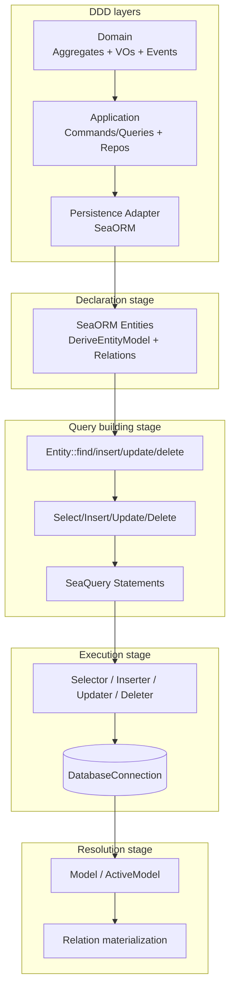

# Domain Model (DDD) + SeaORM + Seaography (Turso/SQLite)

This folder is the **domain model baseline** for the Albergue Municipal Carrascalejo system.

**Single source of truth:** [schema.ts](file:///wsl.localhost/Ubuntu/home/glam/git/personal/AlbergueMunicipalCarrascalejo/domain_model/schema.ts)

Target database: **Turso (SQLite-compatible)**.

## Why this refactor

- The current `schema.ts` expresses the data model used by the frontend and tests.
- We want a **DDD-oriented domain model** (aggregates, value objects, domain events, commands/queries).
- We want a **persistence implementation** using **SeaORM** (Entity / Model / ActiveModel) and **SeaORM migrations**.
- We want an optional **GraphQL API** over the persistence model using **Seaography**.

SeaORM is designed as **layered abstraction**: declaration (entities) → query building (Entity / Select / SeaQuery) → execution (Selector/Inserter/Updater/Deleter) → resolution (rows → Rust types, relations stitched). This refactor aligns those layers with DDD boundaries.

---

## Current Data Model (from schema.ts)

Tables in `schema.ts`:

- `users`
- `pilgrims`
- `beds`
- `bookings`
- `payments`
- `pricing`
- `government_submissions`

### ER Diagram



---

## Domain Model (DDD)

### Bounded Contexts

- **Identity**: capturing, validating, and retaining pilgrim identity (PII encrypted at rest)
- **Booking**: reservations, lifecycle, expiry rules, and payment capture
- **Inventory**: bed status, availability, maintenance/cleaning states
- **Pricing**: dynamic pricing rules for room/bed types
- **Compliance**: submission of required data to government systems

### Aggregates

- **PilgrimAggregate (Identity)**
  - Root: `Pilgrim`
  - Owns encrypted identity fields + consent/retention fields

- **BookingAggregate (Booking)**
  - Root: `Booking`
  - Child entities (modeled as separate tables but treated as part of aggregate in write-path):
    - `Payment`
    - `GovernmentSubmission`
  - References:
    - `PilgrimId` (required)
    - `BedId` (optional until assigned)

- **BedAggregate (Inventory)**
  - Root: `Bed`
  - Owns status transitions: `available | reserved | occupied | maintenance | cleaning`

- **PricingAggregate (Pricing)**
  - Root: `PricingRule`

- **UserAggregate (Auth)**
  - Root: `User`

### Aggregate Diagram



### Value Objects (examples)

- `BookingId`, `PilgrimId`, `BedId`, `PaymentId` (opaque identifiers)
- `ReferenceNumber`
- `BookingPeriod(check_in, check_out)`
- `Money(amount, currency)`
- `Email`, `Phone`
- `DocumentType`, `DocumentNumber`, `DocumentSupport`
- `BedStatus`, `BookingStatus`, `PaymentStatus`, `SubmissionStatus`
- `EncryptedString` (domain wrapper; encryption happens in adapters)

### Domain Events (examples)

- `PilgrimRegistered`
- `PilgrimConsentGranted`
- `BookingReserved`
- `BookingBedAssigned`
- `PaymentRequested`
- `PaymentRecorded`
- `BookingConfirmed`
- `BookingExpired`
- `BookingCancelled`
- `GovernmentSubmissionQueued`
- `GovernmentSubmissionSucceeded`
- `GovernmentSubmissionFailed`
- `BedStatusChanged`

### Commands and Queries

Commands (write):

- `RegisterPilgrim`
- `UpdatePilgrimContact`
- `ReserveBooking`
- `AssignBedToBooking`
- `RecordPayment`
- `ConfirmBooking`
- `ExpireReservations`
- `QueueGovernmentSubmission`
- `SetBedStatus`
- `SetPricingRule`

Queries (read):

- `GetBookingByReference`
- `GetPilgrimByDocument`
- `ListAvailableBeds(period, roomType)`
- `GetDashboardStats` (available/occupied/reserved/maintenance)
- `GetPricing(roomType, bedType)`

---

## Mapping DDD → SeaORM internals

SeaORM’s core types map cleanly to DDD layers:

- **Declaration stage (entities):**
  - One Rust module per table.
  - `#[derive(DeriveEntityModel)]` defines `Model` (read), `ActiveModel` (write).
  - `Relation` + `impl Related` encode foreign keys and navigation.

- **Query building stage:**
  - Simple CRUD: `Entity::find`, `Entity::insert`, `Entity::update`, `Entity::delete`.
  - Richer operations: `Select/Insert/Update/Delete` structs (filter, join, pagination).
  - Escape hatch: SeaQuery `SelectStatement`/`UpdateStatement` etc.

- **Execution stage:**
  - Queries are executed with `db: DatabaseConnection` and return `Result`.

- **Resolution stage:**
  - Rows are converted into `Model` (and `into_active_model()`), relations can be loaded.

DDD guidance:

- **Aggregates live in the domain crate**, independent of SeaORM.
- **Repositories live in the application layer** and use SeaORM entities as an adapter.
- **Domain events are emitted by command handlers**, persisted/published by adapters.

---

## Seaography (GraphQL over SeaORM)

Seaography can expose a GraphQL schema automatically from SeaORM entities (filters, pagination, nested relations).

Typical workflow:

```bash
cargo install sea-orm-cli@2.0.0-rc.27
cargo install seaography-cli@^2.0.0-rc

# Generate SeaORM entities (dense or compact) from SQLite schema
sea-orm-cli generate entity -u sqlite://albergue.db -o ./src/entities --seaography

# Generate a ready-to-run GraphQL server (axum/poem/actix)
seaography-cli -o ./ --entities ./src/entities --database-url sqlite://albergue.db albergue-graphql
```

---

## Event Flow (booking happy-path)



---

## SeaORM Architecture (how we’ll use it)



---

## Planned Improvements to schema.ts (still source-of-truth)

We will extend the schema to cover cross-cutting concerns already implied by the system:

- `notifications` (delivery attempts per booking/pilgrim)
- `audit_log` (GDPR/NIS2 access logging)

These will remain optional to adopt by existing UI flows until wired.

---

## Next steps (what will be added to the repo)

- A Rust workspace under `domain_model/rust/`:
  - `crates/domain`: aggregates, value objects, domain events
  - `crates/persistence`: SeaORM entities + repository adapters
  - `crates/migration`: SeaORM migrations (SQLite)
  - `crates/seaography`: optional GraphQL server over entities

- Updated `schema.ts` relationships and new tables (`notifications`, `audit_log`).

- Commands to run locally against SQLite (and later Turso):

```bash
# Run migrations (SQLite)
cargo run -p albergue-migration -- up

# Start GraphQL
DATABASE_URL=sqlite://albergue.db cargo run -p albergue-seaography
```

## Turso / libsql Connectivity

SeaORM connects via SQLx's SQLite driver, which expects a local SQLite file or local SQLite URI.
To connect to Turso (`libsql://...`), we use libsql embedded replicas to maintain a local SQLite file, then point SeaORM at that local file.

Turso (remote) quickstart:

```bash
turso auth login
turso db create albergue-dev
turso db show albergue-dev --url
turso db tokens create albergue-dev
```

Migrate and verify using a local replica:

```bash
export TURSO_DATABASE_URL="$(turso db show albergue-dev --url)"
export TURSO_AUTH_TOKEN="$(turso db tokens create albergue-dev)"
export TURSO_REPLICA_PATH=albergue.local.db

DATABASE_URL="$TURSO_DATABASE_URL" TURSO_AUTH_TOKEN="$TURSO_AUTH_TOKEN" TURSO_REPLICA_PATH="$TURSO_REPLICA_PATH" \
  cargo run -p albergue-turso-sync --manifest-path domain_model/rust/Cargo.toml

DATABASE_URL="sqlite://$TURSO_REPLICA_PATH" \
  cargo run -p albergue-migration --manifest-path domain_model/rust/Cargo.toml -- up

DATABASE_URL="$TURSO_DATABASE_URL" TURSO_AUTH_TOKEN="$TURSO_AUTH_TOKEN" TURSO_REPLICA_PATH="$TURSO_REPLICA_PATH" \
  cargo run -p albergue-turso-sync --manifest-path domain_model/rust/Cargo.toml

DATABASE_URL="sqlite://$TURSO_REPLICA_PATH" \
  cargo run -p albergue-migration --manifest-path domain_model/rust/Cargo.toml -- status
```

Validate on Turso:

```bash
turso db shell albergue-dev
```

Then run:

- `select name from sqlite_master where type = "table";`
- `select * from seaql_migrations order by version desc limit 20;`
- `select id, username from users where username = "synthetic_admin";`

GraphQL serves at `http://127.0.0.1:8000/graphql`.

## Migrations (SeaORM)

We use `sea-orm-migration` for schema evolution.

Create a new migration file (example pattern):

```bash
sea-orm-cli migrate generate <name>
```

Then implement MigrationTrait in the generated file and register it in MigratorTrait::migrations. Name files with mYYYYMMDD_HHMMSS_migration_name.rs and use #[derive(DeriveMigrationName)] for the migration struct.

Note: This is conceptually the same "first migration" workflow as typical tutorials: create the migration scaffolding, implement `up`/`down`, and run it against the database.

## Running Migrations (Cargo + sea-orm-cli)

SeaORM migrations can be applied from the terminal using either the migrator binary (Cargo) or `sea-orm-cli`. In both cases, set `DATABASE_URL`.

Common commands:

- Apply all pending migrations: `up`
- Rollback last applied migration: `down`
- Show status of all migrations: `status`
- Drop all tables then re-apply: `fresh`
- Rollback all then re-apply: `refresh`
- Rollback all applied: `reset`

Via Cargo (runs our migrator CLI):

```bash
DATABASE_URL=sqlite://albergue.db cargo run -p albergue-migration --manifest-path domain_model/rust/Cargo.toml -- up
DATABASE_URL=sqlite://albergue.db cargo run -p albergue-migration --manifest-path domain_model/rust/Cargo.toml -- status
DATABASE_URL=sqlite://albergue.db cargo run -p albergue-migration --manifest-path domain_model/rust/Cargo.toml -- fresh
```

Via sea-orm-cli (executes the same cargo command under the hood):

```bash
cargo install sea-orm-cli@2.0.0-rc.27
DATABASE_URL=sqlite://albergue.db sea-orm-cli migrate -d domain_model/rust/crates/migration up
DATABASE_URL=sqlite://albergue.db sea-orm-cli migrate -d domain_model/rust/crates/migration status
```

Via Turso (remote, using local replica):

```bash
DATABASE_URL="$TURSO_DATABASE_URL" TURSO_AUTH_TOKEN="$TURSO_AUTH_TOKEN" TURSO_REPLICA_PATH="$TURSO_REPLICA_PATH" \
  cargo run -p albergue-turso-sync --manifest-path domain_model/rust/Cargo.toml

DATABASE_URL="sqlite://$TURSO_REPLICA_PATH" \
  cargo run -p albergue-migration --manifest-path domain_model/rust/Cargo.toml -- status
```

Validate we're on the right track:

- After `up`/`fresh`/`refresh`, `status` should show all migrations as Applied.
- After `reset`, `status` should show all migrations as Pending.

Synthetic test data:

- The latest migration inserts a `synthetic_admin` user (if missing) so you can confirm the pipeline end-to-end.

## Logging (SeaORM + SQLx)

SeaORM logs SQL statements through the `tracing` crate. In this workspace we enable SeaORM statement logging via the `debug-print` feature flag and initialize `tracing-subscriber` in the binaries.

Statement logging:

- Build-time: enabled through `sea-orm` feature `debug-print`.
- Run-time: set `RUST_LOG=debug` (or a more specific filter) to view SQL statements.

SQLx logging:

- Controlled by `ALBERGUE_SQLX_LOGGING`:
  - `ALBERGUE_SQLX_LOGGING=true` enables SQLx logs
  - unset/false disables SQLx logs

Example:

```bash
RUST_LOG=debug ALBERGUE_SQLX_LOGGING=false DATABASE_URL=sqlite://albergue.db cargo run -p albergue-seaography --manifest-path domain_model/rust/Cargo.toml
```
